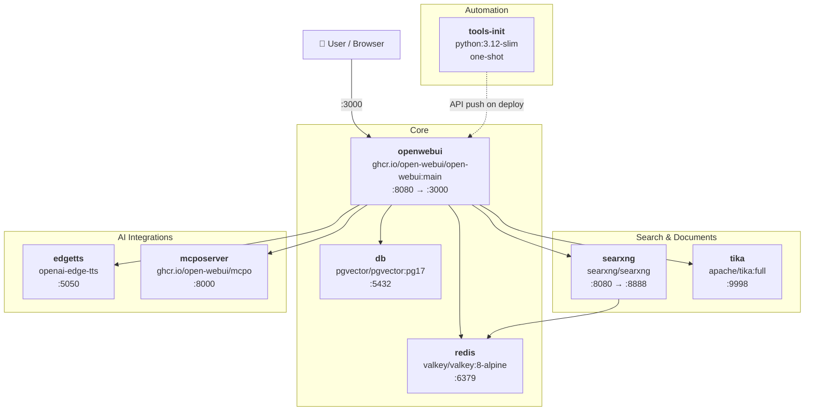

<h1 align="center">
  
  
  
  
  <br>
  <br>
  <code><strong>open-webui-ultimate-stack</strong></code>
</h1>

<p align="center">
  
  
  
</p>

<p align="center">
  <a href="https://openwebui.com">Open WebUI</a> deployment with RAG, private web search, OCR, local TTS, and MCP tool servers.<br>
	Includes a curated library of tools, filters, and function pipes: pushed automatically on deploy via the internal API.
  <br>
  Provides standalone <code>docker-compose.yml</code> and a Docker Swarm <code>docker-stack-compose.yml</code>.
</p>

<br>
<br>


## Quick Start

For single-host / Docker Compose deployments:

```bash
git clone https://github.com/BitWise-0x/open-webui-ultimate-stack && cd open-webui-ultimate-stack && ./bootstrap.sh
```

`bootstrap.sh` copies env examples, generates secrets, validates your configuration, and starts the stack. Open WebUI will be available at **http://localhost:3000**.

For additional deployment details, including Docker Swarm, see the [Deployment](#deployment) section below.

<br>
<br>

## Architecture



<br>

## Services

<table>
<tr>
<td valign="top">

### Core


- **openwebui**: Open WebUI with RAG, tools, pipelines, and multi-model support
- **db**: PostgreSQL 17 with pgvector for vector embeddings and semantic search
- **redis**: Valkey (Redis-compatible) for WebSocket session management and caching

</td>
</tr>
<tr>
<td valign="top">

### Search & Documents


- **searxng**: private metasearch engine aggregating 70+ sources with no tracking
- **tika**: Apache Tika with Tesseract OCR for extracting text from PDFs, images, and Office docs; OCR behavior is tunable via `conf/tika/customocr/org/apache/tika/parser/ocr/TesseractOCRConfig.properties`

</td>
</tr>
<tr>
<td valign="top">

### AI Integrations


- **edgetts**: local text-to-speech server (Microsoft Edge voices, OpenAI-compatible API)
- **mcposerver**: MCP to OpenAPI proxy; exposes MCP tool servers as REST endpoints consumable by Open WebUI

</td>
</tr>
<tr>
<td valign="top">

### Automation


- **tools-init**: one-shot init container; waits for Open WebUI to be healthy, then pushes all tools, filters, and function pipes from `conf/tools/` via the REST API; runs on every deploy with upsert support

</td>
</tr>
</table>

<br>

<br>

## Tools & Extensions

<table>
<tr>
<td valign="top">

### Filters


Pipeline filters that run on every message to pre- or post-process input and output.

- `clean_thinking_tags_filter`: strips `<think>` blocks from model responses
- `full_document_filter`: injects full document context into the prompt
- `prompt_enhancer_filter`: rewrites user prompts before they reach the model
- `semantic_router_filter`: routes queries to a configured model based on content
- `doodle_paint_filter`: injects artistic style directives
- `openrouter_websearch_citations_filter`: formats and surfaces OpenRouter web search citations
- `glm_v_box_token_filter`: strips `<|begin_of_box|>` and `<|end_of_box|>` tokens from GLM V model responses

</td>
</tr>
<tr>
<td valign="top">

### Tools


Native tool-use extensions the model can call during a conversation.

- `arxiv_search_tool`: search and retrieve academic papers from arXiv
- `wiki_search_tool`: Wikipedia search and summary
- `searxng_image_search_tool`: image search via the local SearXNG instance
- `comfyui_text_to_image_tool`: text-to-image generation via ComfyUI
- `comfyui_image_to_image_tool`: image editing and transformation via ComfyUI
- `comfyui_ace_step_audio_tool`: AI audio generation via ComfyUI (v1)
- `comfyui_ace_step_audio_tool_1_5`: ACE Step v1.5 with selectable encoders
- `comfyui_vibevoice_tts_tool`: expressive voice TTS via ComfyUI VibeVoice
- `text_to_video_comfyui_tool`: text-to-video via ComfyUI Wan2.2
- `youtube_search_tool`: YouTube search and metadata
- `pexels_image_search_tool`: Pexels royalty-free image search
- `openweathermap_forecast_tool`: live weather forecasts
- `native_image_gen`: built-in Open WebUI image generation
- `create_image_hf`: image generation via Hugging Face Inference API
- `create_image_cf`: image generation via Cloudflare Workers AI
- `philosopher_api_tool`: philosophical reasoning and quotes
- `rpg_tool_set`: RPG dice, character generation, and game utilities
- `perplexica_search`: web search via local Perplexica instance

</td>
</tr>
<tr>
<td valign="top">

### Function Pipes


Full pipeline functions that replace or augment the model's response loop.

- `planner`: multi-step task decomposition and planning
- `multi_model_conversation_v2`: run parallel conversations across multiple models simultaneously
- `research_pipe`: multi-source research pipeline
- `openrouter_image_pipe`: image generation routing via OpenRouter
- `flux_kontext_comfyui_pipe`: Flux Kontext image editing pipeline via ComfyUI
- `veo3_pipe`: video generation pipeline
- `resume`: resume analysis and career coaching pipeline
- `perplexica_pipe`: AI search pipeline via local Perplexica instance
- `letta_agent`: connects to Letta autonomous agents with SSE streaming and tool call support
- `mopidy_music_controller`: controls Mopidy music server for local library and YouTube playback

</td>
</tr>
<tr>
<td valign="top">

### ComfyUI Workflows (`extras/`)


ComfyUI API workflows and sample data for use with the bundled tools.

- Flux Kontext image editing
- ACE Step audio generation (v1 + v1.5)
- Vibe Voice TTS (single speaker + multi-speaker)
- Wan2.2 14B text-to-video
- Qwen image editing (standard + 2509 API)

</td>
</tr>
</table>

<br>

<br>

## Repository Structure

```
open-webui-ultimate-stack/
├── docker-compose.yml           Standalone: local / single-host
├── docker-stack-compose.yml     Docker Swarm: production
├── .env.example                 Top-level swarm variables (copy → .env)
├── .gitignore
├── bootstrap.sh                 Setup, secrets generation, validation, and deployment
├── scripts/
│   ├── deploy-swarm.sh          Swarm deploy helper
│   ├── remove-swarm.sh          Swarm teardown helper
│   └── install-tools.sh         Init container: auto-push tools via API
├── conf/
│   ├── searxng/                 settings.yml, uwsgi.ini, limiter.toml
│   ├── tika/                    tika-config.xml + OCR properties
│   ├── mcposerver/              config.json.example (template; config.json gitignored)
│   ├── postgres/init/           Custom entrypoint + pgvector init (entrypoint.sh)
│   └── tools/
│       ├── filters/             Python pipeline filters (auto-deployed)
│       ├── tools/               Python tool definitions (auto-deployed)
│       ├── functions/           Python pipes and functions (auto-deployed)
│       └── extras/              ComfyUI API workflows and sample data
├── docs/
│   └── passwordreset.md            Emergency password reset runbook
├── env/                         Per-service env.example files
│   ├── owui.env.example
│   ├── db.env.example
│   ├── redis.env.example
│   ├── edgetts.env.example
│   ├── mcp.env.example
│   ├── searxng.env.example
│   ├── tika.env.example
│   └── tools-init.env.example
└── README.md
```

<br>

<br>

## Configuration

| File | Purpose |
|------|---------|
| `env/owui.env` | Open WebUI: LLM keys, RAG, websocket, TTS, image gen, permissions |
| `env/db.env` | PostgreSQL credentials |
| `env/redis.env` | Valkey notes (no required vars) |
| `env/searxng.env` | SearXNG secret, workers, base URL |
| `env/tika.env` | Tika version tag |
| `env/edgetts.env` | Default voice, speed, format |
| `env/mcp.env` | Reference DATABASE_URL for mcpo |
| `env/tools-init.env` | Admin credentials used by tools-init to sign in and push tools on every deploy |

<br>

<br>

## Deployment

### Standalone (local / single host)

Set these before running:

| File | Variable | Description |
|---|---|---|
| `env/owui.env` | `WEBUI_ADMIN_EMAIL` | Admin account email |
| `env/owui.env` | `WEBUI_ADMIN_PASSWORD` | Admin password (uppercase, lowercase, digit, special char, 8+ chars) |
| `env/owui.env` | `OLLAMA_BASE_URL` | Optional — your Ollama instance URL |
| `env/owui.env` | `OPENAI_API_KEY` | Optional — your OpenAI API key |

> **Note:** `env/tools-init.env` must have matching `OWUI_ADMIN_EMAIL` and `OWUI_ADMIN_PASSWORD` — `bootstrap.sh` syncs them automatically from `env/owui.env` whenever the values differ.

Then run:

```bash
./bootstrap.sh
```

`bootstrap.sh` copies env examples, generates all secrets, validates your configuration, syncs credentials to `env/tools-init.env`, and starts the stack. Open WebUI will be available at **http://localhost:3000**.

<br>

### Docker Swarm

Set these before running:

| File | Variable | Description |
|---|---|---|
| `.env` | `STACK_NAME` | Stack name (default: `open-webui`) |
| `.env` | `DATA_ROOT` | Shared filesystem path on Swarm nodes (GlusterFS, NFS, etc.) |
| `.env` | `ROUTER_NAME` | Subdomain for CORS and Traefik labels (e.g. `openwebui`) |
| `.env` | `ROOT_DOMAIN` | Base domain for CORS and Traefik labels (e.g. `yourdomain.com`) |
| `.env` | `BACKEND_NETWORK_NAME` | Overlay network name (default: `open-webui_backend`) |
| `.env` | `TIKA_TAG` | Apache Tika version (default: `3.2.2.0`) |
| `.env` | `REDIS_DATA_ROOT` | Optional — separate high-IOPS mount for Redis data (defaults to `DATA_ROOT`) |
| `env/owui.env` | `WEBUI_ADMIN_EMAIL` | Admin account email |
| `env/owui.env` | `WEBUI_ADMIN_PASSWORD` | Admin password (uppercase, lowercase, digit, special char, 8+ chars) |
| `env/owui.env` | `OLLAMA_BASE_URL` | Optional — your Ollama instance URL |
| `env/owui.env` | `OPENAI_API_KEY` | Optional — your OpenAI API key |
| `env/owui.env` | `FORWARDED_ALLOW_IPS` | Overlay subnet CIDR — `deploy-swarm.sh` uses this to create the network (e.g. `10.0.13.0/24`) |
| `env/searxng.env` | `SEARXNG_BASE_URL` | Set to `http://searxng:8080/` for Swarm (standalone default `http://localhost:8888/` won't work) |

> **Note:** `WEBUI_ADMIN_EMAIL` and `WEBUI_ADMIN_PASSWORD` must match in both `env/owui.env` and `env/tools-init.env`. `bootstrap.sh --swarm` syncs them automatically whenever the values differ.

Then run:

```bash
./bootstrap.sh --swarm
```

`bootstrap.sh --swarm` copies env examples, generates all secrets, validates your configuration, syncs credentials to `env/tools-init.env`, and calls `deploy-swarm.sh` to create the overlay network, external volumes, sync `conf/` to `DATA_ROOT`, and deploy the stack.

`bootstrap.sh --swarm` is safe to re-run on redeploy or update — it re-syncs `conf/` to `DATA_ROOT` and redeploys the stack without touching existing secrets or data volumes.

Monitor:

```bash
docker stack ps ${STACK_NAME:-open-webui}
docker service logs -f ${STACK_NAME:-open-webui}_openwebui
```

Remove stack (preserves data volumes by default):

```bash
./scripts/remove-swarm.sh
```

To also remove data volumes after removal (**destroys all data**):

```bash
docker volume rm ${STACK_NAME:-open-webui}_postgresdata ${STACK_NAME:-open-webui}_searxngcache
docker network rm ${BACKEND_NETWORK_NAME:-open-webui_backend}
```

<br>

<br>

## Credits

The tools, filters, and function pipes bundled in `conf/tools/` were authored primarily by
**[Haervwe](https://github.com/Haervwe)** from the
**[open-webui-tools](https://github.com/Haervwe/open-webui-tools)** project.

Additional contributions by:
[tan-yong-sheng](https://github.com/tan-yong-sheng), pupphelper, Zed Unknown, and justinrahb.

All tools retain their original author metadata in their docstring headers.


<br>

## License

MIT License: see [LICENSE](LICENSE) for details.
