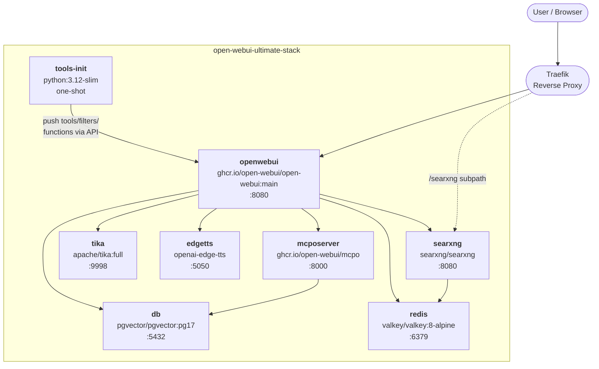

<h1 align="center">
  
  
  
  
  <br>
  <br>
  <code><strong style="font-size:1.4em; letter-spacing:0.02em;">open-webui-ultimate-stack</strong></code>
</h1>

<p align="center">
  
  
  
</p>

<p align="center">
  Open WebUI deployment with RAG, private web search, OCR, local TTS, and MCP tool servers.<br>
  Ships as both a standalone <code>docker-compose.yml</code> and a Docker Swarm <code>docker-stack-compose.yml</code>.<br>
  Includes a curated library of tools, filters, and function pipes: pushed into Open WebUI automatically on every deploy via the internal API.
</p>

<br>
<br>


## Quick Start

```bash
git clone https://github.com/BitWise-0x/open-webui-ultimate-stack && cd open-webui-ultimate-stack && ./bootstrap.sh
```

The bootstrap script:
- verifies Docker and Docker Compose v2 are installed
- copies all `env/*.env.example` files to `env/*.env`
- generates random `WEBUI_SECRET_KEY`, `SEARXNG_SECRET`, and `POSTGRES_PASSWORD`
- creates `conf/mcposerver/config.json` from its example and injects the DB password
- prompts for optional Ollama URL and OpenAI API key (disables each if skipped)
- runs `docker compose up -d` and prints access URLs

Open WebUI will be available at **http://localhost:3000** once all containers are healthy.

<br>
<br>

## Architecture



<br>


## Services

<table>
<tr>
<td width="50%" valign="top">

### Core


- **openwebui**: Open WebUI with RAG, tools, pipelines, and multi-model support
- **db**: PostgreSQL 17 with pgvector for vector embeddings and semantic search
- **redis**: Valkey (Redis-compatible) for WebSocket session management and caching

</td>
<td width="50%" valign="top">

### Search & Documents


- **searxng**: private metasearch engine aggregating 70+ sources with no tracking
- **tika**: Apache Tika with Tesseract OCR for extracting text from PDFs, images, and Office docs; OCR behavior is tunable via `conf/tika/customocr/TesseractOCRConfig.properties`
- **docling** *(optional)*: heavy document extraction service with advanced layout understanding; enable by uncommenting from the compose file and configuring `env/docling.env`

</td>
</tr>

<tr>
<td width="50%" valign="top">

### AI Integrations


- **edgetts**: local text-to-speech server (Microsoft Edge voices, OpenAI-compatible API)
- **mcposerver**: MCP to OpenAPI proxy; exposes MCP tool servers as REST endpoints consumable by Open WebUI

</td>
<td width="50%" valign="top">

### Automation


- **tools-init**: one-shot init container; waits for Open WebUI to be healthy, then pushes all tools, filters, and function pipes from `conf/tools/` via the REST API; runs on every deploy with upsert support

</td>
</tr>
</table>

<br>

<br>

## Tools & Extensions

<table>
<tr>
<td width="50%" valign="top">

### Filters


Pipeline filters that run on every message to pre- or post-process input and output.

- `clean_thinking_tags_filter`: strips `<think>` blocks from model responses
- `full_document_filter`: injects full document context into the prompt
- `prompt_enhancer_filter`: rewrites user prompts before they reach the model
- `semantic_router_filter`: routes queries to a configured model based on content
- `doodle_paint_filter`: injects artistic style directives
- `openrouter_websearch_citations_filter`: formats and surfaces OpenRouter web search citations

</td>
<td width="50%" valign="top">

### Tools


Native tool-use extensions the model can call during a conversation.

- `arxiv_search_tool`: search and retrieve academic papers from arXiv
- `wiki_search_tool`: Wikipedia search and summary
- `searxng_image_search_tool`: image search via the local SearXNG instance
- `comfyui_text_to_image_tool`: text-to-image generation via ComfyUI
- `comfyui_image_to_image_tool`: image editing and transformation via ComfyUI
- `comfyui_ace_step_audio_tool`: AI audio generation via ComfyUI (v1)
- `comfyui_ace_step_audio_tool_1_5`: ACE Step v1.5 with selectable encoders
- `comfyui_vibevoice_tts_tool`: expressive voice TTS via ComfyUI VibeVoice
- `text_to_video_comfyui_tool`: text-to-video via ComfyUI Wan2.1
- `youtube_search_tool`: YouTube search and metadata
- `pexels_image_search_tool`: Pexels royalty-free image search
- `openweathermap_forecast_tool`: live weather forecasts
- `native_image_gen`: built-in Open WebUI image generation
- `create_image_hf`: image generation via Hugging Face Inference API
- `create_image_cf`: image generation via Cloudflare Workers AI
- `philosopher_api_tool`: philosophical reasoning and quotes
- `rpg_tool_set`: RPG dice, character generation, and game utilities

</td>
</tr>
<tr>
<td width="50%" valign="top">

### Function Pipes


Full pipeline functions that replace or augment the model's response loop.

- `planner`: multi-step task decomposition and planning
- `multi_model_conversation_v2`: run parallel conversations across multiple models simultaneously
- `research_pipe`: multi-source research pipeline
- `openrouter_image_pipe`: image generation routing via OpenRouter
- `flux_kontext_comfyui_pipe`: Flux Kontext image editing pipeline via ComfyUI
- `veo3_pipe`: video generation pipeline
- `resume`: resume analysis and career coaching pipeline

</td>
<td width="50%" valign="top">

### ComfyUI Workflows (`extras/`)


ComfyUI API workflow JSONs for use with the bundled tools.

- Flux Kontext image editing
- ACE Step audio generation (v1 + v1.5)
- Vibe Voice TTS (single speaker + multi-speaker)
- Wan2.1 14B text-to-video
- Qwen image editing (standard + 2509 API)

</td>
</tr>
</table>

<br>

<br>

## Repository Structure

```
open-webui-ultimate-stack/
├── docker-compose.yml           Standalone: local / single-host
├── docker-stack-compose.yml     Docker Swarm: production
├── .env.example                 Top-level swarm variables (copy → .env)
├── .gitignore
├── bootstrap.sh                 Interactive local startup wizard
├── scripts/
│   ├── deploy-swarm.sh          Swarm deploy helper
│   ├── remove-swarm.sh          Swarm teardown helper
│   └── install-tools.sh         Init container: auto-push tools via API
├── conf/
│   ├── searxng/                 settings.yml, uwsgi.ini, limiter.toml
│   ├── tika/                    tika-config.xml + OCR properties
│   ├── mcposerver/              config.json.example (template; config.json gitignored)
│   ├── postgres/init/           Custom entrypoint + pgvector init
│   └── tools/
│       ├── filters/             Python pipeline filters (auto-deployed)
│       ├── tools/               Python tool definitions (auto-deployed)
│       ├── functions/           Python pipes and functions (auto-deployed)
│       └── extras/              ComfyUI API workflow JSONs
├── docs/
│   └── passwordreset.md         Emergency password reset runbook
├── env/                         Per-service env.example files
│   ├── owui.env.example
│   ├── db.env.example
│   ├── redis.env.example
│   ├── edgetts.env.example
│   ├── mcp.env.example
│   ├── searxng.env.example
│   ├── tika.env.example
│   ├── tools-init.env.example
│   └── docling.env.example      Optional heavy document extraction service
└── README.md
```

<br>

<br>

## Configuration

All sensitive values live in `env/` files that are git-ignored. The `.example` variants are tracked and serve as templates. `conf/mcposerver/config.json` is also git-ignored: it is generated from `config.json.example` at bootstrap/deploy time with the real Postgres password injected.

```bash
# Initial setup (done automatically by bootstrap.sh)
for f in env/*.env.example; do cp "$f" "${f%.example}"; done
```

| File | Purpose |
|------|---------|
| `env/owui.env` | Open WebUI: LLM keys, RAG, websocket, TTS, image gen, permissions |
| `env/db.env` | PostgreSQL credentials |
| `env/redis.env` | Valkey notes (no required vars) |
| `env/searxng.env` | SearXNG secret, workers, base URL (`http://localhost:8888/` standalone; `/searxng` Swarm+Traefik) |
| `env/tika.env` | Tika version tag |
| `env/edgetts.env` | Default voice, speed, format |
| `env/mcp.env` | Reference DATABASE_URL for mcpo |
| `env/tools-init.env` | OWUI API key and URL for tool push |

<br>

**Secrets to generate before starting:**

```bash
# WEBUI_SECRET_KEY and SEARXNG_SECRET
openssl rand -hex 32

# POSTGRES_PASSWORD
openssl rand -base64 24
```

<br>

<br>

## Deployment

### Standalone (local / single host)

```bash
./bootstrap.sh
```

Or manually:

```bash
for f in env/*.env.example; do cp "$f" "${f%.example}"; done
# edit env/owui.env: set WEBUI_SECRET_KEY, OPENAI_API_KEY, etc.
docker compose up -d
```

Access:

- Open WebUI → http://localhost:3000
- SearXNG → http://localhost:8888

<br>

### Docker Swarm (production)

**Prerequisites:** Traefik deployed with `traefik-public` overlay network and `chain-oauth@file` middleware.

```bash
cp .env.example .env
# edit .env: set ROUTER_NAME, ROOT_DOMAIN, DATA_ROOT, DB_NODE_HOSTNAME
for f in env/*.env.example; do cp "$f" "${f%.example}"; done
# edit env/owui.env, env/db.env, etc.: fill real values
# For Swarm, set SEARXNG_BASE_URL=/searxng in env/searxng.env

./scripts/deploy-swarm.sh
# deploy-swarm.sh creates the overlay network and external volumes, then syncs
# conf/tools, conf/postgres/init, conf/mcposerver (with password injected),
# conf/tika, and conf/searxng to DATA_ROOT, then deploys the stack.
```

Monitor:

```bash
docker stack ps open-webui
docker service logs -f open-webui_openwebui
```

> **First deploy: tools-init two-phase setup:**
> On the very first deploy, `tools-init` will fail because no API key exists yet (Open WebUI
> hasn't been configured). This is expected. After the stack is up:
>
> 1. Open Open WebUI, create your admin account
> 2. Go to Settings > Account > API Keys and generate a key
> 3. Set `OWUI_API_KEY=<your_key>` in `env/tools-init.env`
> 4. Force-update the service: `docker service update --force ${STACK_NAME}_tools-init`

<br>

Remove stack:

```bash
./scripts/remove-swarm.sh
```

<br>

<br>

## Credits

The tools, filters, and function pipes bundled in `conf/tools/` were authored primarily by
**[Haervwe](https://github.com/Haervwe)** from the
**[open-webui-tools](https://github.com/Haervwe/open-webui-tools)** project.

Additional contributions by:
[tan-yong-sheng](https://github.com/tan-yong-sheng), pupphelper, Zed Unknown, and justinrahb.

All tools retain their original author metadata in their docstring headers.


<br>

## License

MIT License: see [LICENSE](LICENSE) for details.
