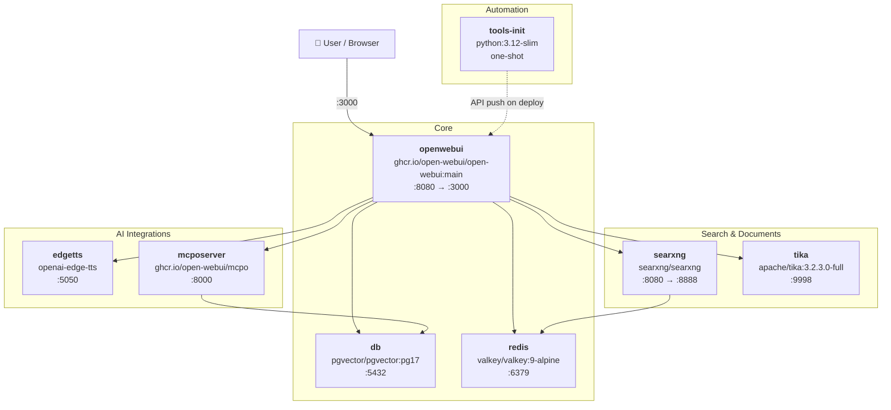

<h1 align="center">
  
  
  
  
  <br>
  <br>
  <code><strong>open-webui-ultimate-stack</strong></code>
</h1>

<p align="center">
  
  
  
</p>

<p align="center">
  <a href="https://openwebui.com">Open WebUI</a> deployment with RAG, private web search, OCR, local TTS, and MCP tool servers.<br>
	Includes a curated library of tools, filters, and function pipes — pushed automatically on every deploy via the internal API.
  <br>
  Provides standalone <code>docker-compose.yml</code> and a production-ready Docker Swarm <code>docker-stack-compose.yml</code>.
</p>

<br>
<br>


## Quick Start

For single-host / Docker Compose deployments:

```bash
git clone https://github.com/BitWise-0x/open-webui-ultimate-stack && cd open-webui-ultimate-stack && ./bootstrap.sh
```

`bootstrap.sh` copies env examples, generates secrets, validates your configuration, and starts the stack. Open WebUI will be available at **http://localhost:3000**.

For additional deployment details, including Docker Swarm, see the [Deployment](#deployment) section below.

<br>
<br>

## Architecture



<br>

## Services

<table>
<tr>
<td valign="top">

### Core


- **openwebui**: Open WebUI with RAG, tools, pipelines, and multi-model support
- **db**: PostgreSQL 17 with pgvector for vector embeddings and semantic search
- **redis**: Valkey (Redis-compatible) for WebSocket session management and caching

</td>
</tr>
<tr>
<td valign="top">

### Search & Documents


- **searxng**: private metasearch engine aggregating 70+ sources with no tracking
- **tika**: Apache Tika with Tesseract OCR for extracting text from PDFs, images, and Office docs; OCR behavior is tunable via `conf/tika/customocr/org/apache/tika/parser/ocr/TesseractOCRConfig.properties`

</td>
</tr>
<tr>
<td valign="top">

### AI Integrations


- **edgetts**: local text-to-speech server (Microsoft Edge voices, OpenAI-compatible API)
- **mcposerver**: MCP to OpenAPI proxy; exposes MCP tool servers as REST endpoints consumable by Open WebUI

</td>
</tr>
<tr>
<td valign="top">

### Automation


- **tools-init**: one-shot init container; waits for Open WebUI to be healthy, then pushes all tools, filters, and function pipes from `conf/tools/` via the REST API; runs on every deploy with upsert support

</td>
</tr>
</table>

<br>

<br>

## Tools & Extensions

<table>
<tr>
<td valign="top">

### Filters


Pipeline filters that run on every message to pre- or post-process input and output.

- `clean_thinking_tags_filter`: strips `<think>` blocks from model responses
- `full_document_filter`: injects full document context into the prompt
- `prompt_enhancer_filter`: rewrites user prompts before they reach the model
- `semantic_router_filter`: routes queries to a configured model based on content
- `doodle_paint_filter`: injects artistic style directives
- `openrouter_websearch_citations_filter`: formats and surfaces OpenRouter web search citations
- `glm_v_box_token_filter`: strips `<|begin_of_box|>` and `<|end_of_box|>` tokens from GLM V model responses

</td>
</tr>
<tr>
<td valign="top">

### Tools


Native tool-use extensions the model can call during a conversation.

- `arxiv_search_tool`: search and retrieve academic papers from arXiv
- `wiki_search_tool`: Wikipedia search and summary
- `searxng_image_search_tool`: image search via the local SearXNG instance
- `comfyui_text_to_image_tool`: text-to-image generation via ComfyUI
- `comfyui_image_to_image_tool`: image editing and transformation via ComfyUI
- `comfyui_ace_step_audio_tool`: AI audio generation via ComfyUI (v1)
- `comfyui_ace_step_audio_tool_1_5`: ACE Step v1.5 with selectable encoders
- `comfyui_vibevoice_tts_tool`: expressive voice TTS via ComfyUI VibeVoice
- `text_to_video_comfyui_tool`: text-to-video via ComfyUI Wan2.2
- `youtube_search_tool`: YouTube search and metadata
- `pexels_image_search_tool`: Pexels royalty-free image search
- `openweathermap_forecast_tool`: live weather forecasts
- `native_image_gen`: built-in Open WebUI image generation
- `create_image_hf`: image generation via Hugging Face Inference API
- `create_image_cf`: image generation via Cloudflare Workers AI
- `philosopher_api_tool`: philosophical reasoning and quotes
- `rpg_tool_set`: RPG dice, character generation, and game utilities
- `perplexica_search`: web search via local Perplexica instance

</td>
</tr>
<tr>
<td valign="top">

### Function Pipes


Full pipeline functions that replace or augment the model's response loop.

- `planner`: multi-step task decomposition and planning
- `multi_model_conversation_v2`: run parallel conversations across multiple models simultaneously
- `research_pipe`: multi-source research pipeline
- `openrouter_image_pipe`: image generation routing via OpenRouter
- `flux_kontext_comfyui_pipe`: Flux Kontext image editing pipeline via ComfyUI
- `veo3_pipe`: video generation pipeline
- `resume`: resume analysis and career coaching pipeline
- `perplexica_pipe`: AI search pipeline via local Perplexica instance
- `letta_agent`: connects to Letta autonomous agents with SSE streaming and tool call support
- `mopidy_music_controller`: controls Mopidy music server for local library and YouTube playback

</td>
</tr>
<tr>
<td valign="top">

### ComfyUI Workflows (`extras/`)


ComfyUI API workflows and sample data for use with the bundled tools.

- Flux Kontext image editing
- ACE Step audio generation (v1 + v1.5)
- Vibe Voice TTS (single speaker + multi-speaker)
- Wan2.2 14B text-to-video
- Qwen image editing (standard + 2509 API)

</td>
</tr>
</table>

<br>

<br>

## Repository Structure

```
open-webui-ultimate-stack/
├── docker-compose.yml           Standalone: local / single-host
├── docker-stack-compose.yml     Docker Swarm: production
├── .env.example                 Top-level variables (STACK_NAME, DATA_ROOT, TIKA_TAG, etc.)
├── .gitignore
├── bootstrap.sh                 Setup, secrets generation, validation, and deployment
├── scripts/
│   ├── deploy-swarm.sh          Swarm deploy: network, volumes, conf sync, deploy
│   ├── remove-swarm.sh          Swarm teardown (preserves data volumes)
│   └── install-tools.sh         Auto-push tools/filters/pipes via REST API
├── conf/
│   ├── wait-for-services.sh     TCP dependency gate for Swarm services
│   ├── searxng/                 settings.yml, uwsgi.ini, limiter.toml
│   ├── tika/                    tika-config.xml + Tesseract OCR properties
│   ├── mcposerver/              config.json.example (template; config.json gitignored)
│   ├── postgres/init/           Custom entrypoint: pgvector init + auto-upgrade
│   └── tools/
│       ├── filters/             Python pipeline filters (auto-deployed)
│       ├── tools/               Python tool definitions (auto-deployed)
│       ├── functions/           Python pipes and functions (auto-deployed)
│       └── extras/              ComfyUI API workflows and sample data
├── docs/
│   ├── post-config.md           Post-deployment manual configuration guide
│   └── passwordreset.md         Emergency password reset runbook
├── env/                         Per-service env.example files
│   ├── owui.env.example
│   ├── db.env.example
│   ├── edgetts.env.example
│   ├── mcp.env.example
│   ├── searxng.env.example
│   └── tools-init.env.example
└── README.md
```

<br>

<br>

## Configuration

### Environment Files

| File | Purpose |
|------|---------|
| `.env` | Top-level: `STACK_NAME`, `DATA_ROOT`, `ROUTER_NAME`, `ROOT_DOMAIN`, `BACKEND_NETWORK_NAME`, `TIKA_TAG`, `REDIS_DATA_ROOT` |
| `env/owui.env` | Open WebUI: LLM keys, RAG, websocket, TTS, image gen, CORS, permissions |
| `env/db.env` | PostgreSQL credentials (`POSTGRES_DB`, `POSTGRES_USER`, `POSTGRES_PASSWORD`) |
| `env/searxng.env` | SearXNG secret, workers, base URL |
| `env/edgetts.env` | Default voice, speed, format |
| `env/mcp.env` | `DATABASE_URL` for mcpo proxy |
| `env/tools-init.env` | Admin credentials used by tools-init to authenticate and push tools on every deploy |

All passwords default to `change_me` and are auto-generated by `bootstrap.sh` on first run. The postgres password is synced across `env/db.env`, `env/owui.env`, `env/mcp.env`, and `conf/mcposerver/config.json` automatically.

### Service Configuration

| Directory | Purpose |
|-----------|---------|
| `conf/searxng/` | SearXNG search engine settings, uWSGI workers, and rate limiter config |
| `conf/tika/` | Tika OCR config — tune Tesseract behavior via `customocr/` properties |
| `conf/mcposerver/` | MCP-to-OpenAPI proxy config — `config.json.example` is the template; `config.json` is generated on first run and gitignored |
| `conf/postgres/init/` | Custom PostgreSQL entrypoint that auto-creates and upgrades the pgvector extension on every container start |

<br>

<br>

## Scripts

### `bootstrap.sh`

Single entry point for both standalone and Swarm deployments. Handles the full setup lifecycle:

1. Copies `env/*.env.example` files to `env/*.env` (skips existing)
2. Generates cryptographic secrets for `WEBUI_SECRET_KEY`, `SEARXNG_SECRET`, and `POSTGRES_PASSWORD`
3. Syncs the postgres password into all files that reference it (`owui.env`, `mcp.env`, `mcposerver/config.json`)
4. Validates required configuration (admin email/password, Swarm-specific vars)
5. Syncs admin credentials from `env/owui.env` into `env/tools-init.env`
6. Starts the stack (`docker compose up -d` for standalone, or calls `deploy-swarm.sh` for Swarm)

```bash
./bootstrap.sh          # Standalone (Docker Compose)
./bootstrap.sh --swarm  # Docker Swarm
```

Safe to re-run — skips existing env files and only regenerates secrets that are still set to `change_me`.

### `scripts/deploy-swarm.sh`

Called by `bootstrap.sh --swarm`. Handles Swarm-specific infrastructure setup:

1. Validates `DATA_ROOT` is mounted and reachable
2. Creates service data directories on the shared filesystem with correct ownership
3. Generates `POSTGRES_PASSWORD` if still set to `change_me` (with volume-exists safety check)
4. Generates `SEARXNG_SECRET` and `WEBUI_SECRET_KEY` if needed
5. Creates the overlay network using the CIDR from `FORWARDED_ALLOW_IPS`
6. Creates external volumes (`postgresdata`, `searxngcache`)
7. Syncs `conf/` directories to `DATA_ROOT` via rsync (tools, postgres init, searxng, tika, mcposerver)
8. Injects the postgres password into `mcposerver/config.json` using Python (handles special characters)
9. Sets directory ownership (`999:999` for postgres/redis, `977:977` for searxng)
10. Deploys the stack with `docker stack deploy`

### `scripts/install-tools.sh`

Runs inside the `tools-init` container on every deploy. Authenticates with Open WebUI via the REST API and pushes all Python files from `conf/tools/` (filters, tools, and function pipes) with upsert support — creates new items or updates existing ones.

### `scripts/remove-swarm.sh`

Removes the Swarm stack while preserving external volumes and the overlay network. Prints instructions for manual cleanup if needed.

### `conf/wait-for-services.sh`

POSIX-compatible TCP dependency gate for Docker Swarm. Since Swarm does not support `depends_on`, this script blocks service startup until all specified `host:port` pairs are reachable via TCP, then `exec`s into the real entrypoint.

Used by:
- **searxng** — waits for `redis:6379`
- **mcposerver** — waits for `db:5432`
- **tools-init** — waits for `openwebui:8080`

Auto-detects the TCP check method (`nc`, `python3`, or `python`). Configurable via `WAIT_TIMEOUT` (default: 120s) and `WAIT_INTERVAL` (default: 2s).

### `conf/postgres/init/entrypoint.sh`

Custom PostgreSQL entrypoint that wraps the official `docker-entrypoint.sh`:

1. Removes stale `postmaster.pid` (safe for Swarm rescheduling after crash)
2. Starts the official entrypoint in the background
3. Waits for PostgreSQL to accept connections (up to 300s)
4. Creates the pgvector (`vector`) extension if it doesn't exist
5. Upgrades the extension to match the installed shared library version
6. Forwards `SIGTERM`/`SIGINT`/`SIGQUIT` to the postgres process

<br>

<br>

## Deployment

### Standalone (local / single host)

Uses `docker-compose.yml` with local volumes, `depends_on` health checks, and ports exposed to the host.

Set these before running:

| File | Variable | Description |
|---|---|---|
| `env/owui.env` | `WEBUI_ADMIN_EMAIL` | Admin account email |
| `env/owui.env` | `WEBUI_ADMIN_PASSWORD` | Admin password (uppercase, lowercase, digit, special char, 8+ chars) |
| `env/owui.env` | `OLLAMA_BASE_URL` | Optional — your Ollama instance URL |
| `env/owui.env` | `OPENAI_API_KEY` | Optional — your OpenAI API key |

> **Note:** `env/tools-init.env` must have matching `OWUI_ADMIN_EMAIL` and `OWUI_ADMIN_PASSWORD` — `bootstrap.sh` syncs them automatically from `env/owui.env` whenever the values differ.

Then run:

```bash
./bootstrap.sh
```

Open WebUI will be available at **http://localhost:3000**. SearXNG is exposed on **http://localhost:8888** for optional direct access.

<br>

### Docker Swarm

Uses `docker-stack-compose.yml` with external overlay network, external named volumes, bind mounts from a shared filesystem (`DATA_ROOT`), and `wait-for-services.sh` as a TCP dependency gate (Swarm does not support `depends_on`).

Set these before running:

| File | Variable | Description |
|---|---|---|
| `.env` | `STACK_NAME` | Stack name (default: `open-webui`) |
| `.env` | `DATA_ROOT` | Shared filesystem path accessible from all Swarm nodes (GlusterFS, NFS, etc.) |
| `.env` | `ROUTER_NAME` | Subdomain for CORS and Traefik labels (e.g. `openwebui`) |
| `.env` | `ROOT_DOMAIN` | Base domain for CORS and Traefik labels (e.g. `yourdomain.com`) |
| `.env` | `BACKEND_NETWORK_NAME` | Overlay network name (default: `open-webui_backend`) |
| `.env` | `TIKA_TAG` | Apache Tika version (default: `3.2.3.0`) |
| `.env` | `REDIS_DATA_ROOT` | Optional — separate high-IOPS mount for Redis data (defaults to `DATA_ROOT`) |
| `env/owui.env` | `WEBUI_ADMIN_EMAIL` | Admin account email |
| `env/owui.env` | `WEBUI_ADMIN_PASSWORD` | Admin password (uppercase, lowercase, digit, special char, 8+ chars) |
| `env/owui.env` | `OLLAMA_BASE_URL` | Optional — your Ollama instance URL |
| `env/owui.env` | `OPENAI_API_KEY` | Optional — your OpenAI API key |
| `env/owui.env` | `FORWARDED_ALLOW_IPS` | Overlay subnet CIDR — `deploy-swarm.sh` uses this to create the network (e.g. `10.0.13.0/24`) |
| `env/searxng.env` | `SEARXNG_BASE_URL` | Set to `http://searxng:8080/` for Swarm (standalone default `http://localhost:8888/` won't work) |

> **Note:** `WEBUI_ADMIN_EMAIL` and `WEBUI_ADMIN_PASSWORD` must match in both `env/owui.env` and `env/tools-init.env`. `bootstrap.sh --swarm` syncs them automatically whenever the values differ.

Then run:

```bash
./bootstrap.sh --swarm
```

Safe to re-run on redeploy or update — re-syncs `conf/` to `DATA_ROOT` and redeploys the stack without touching existing secrets or data volumes.

#### What `deploy-swarm.sh` does

```
Local repo                          Shared filesystem (DATA_ROOT)
─────────────                       ─────────────────────────────
conf/tools/         ──rsync──►      open-webui/tools/
conf/postgres/init/ ──rsync──►      open-webui/postgres/init/
conf/searxng/       ──rsync──►      open-webui/searxng/conf/
conf/tika/          ──rsync──►      open-webui/tika/conf/
conf/mcposerver/    ──rsync──►      open-webui/mcposerver/conf/
conf/wait-for-services.sh ──cp──►   open-webui/scripts/wait-for-services.sh
scripts/install-tools.sh  ──cp──►   open-webui/tools/install-tools.sh
```

The deploy script also creates the overlay network (from `FORWARDED_ALLOW_IPS` CIDR), external volumes, sets directory ownership, injects the postgres password into `mcposerver/config.json`, and runs `docker stack deploy`.

#### Monitoring

```bash
docker stack ps ${STACK_NAME:-open-webui}
docker service logs -f ${STACK_NAME:-open-webui}_openwebui
```

#### Teardown

Remove stack (preserves data volumes by default):

```bash
./scripts/remove-swarm.sh
```

To also remove data volumes after removal (**destroys all data**):

```bash
docker volume rm ${STACK_NAME:-open-webui}_postgresdata ${STACK_NAME:-open-webui}_searxngcache
docker network rm ${BACKEND_NETWORK_NAME:-open-webui_backend}
```

<br>

### Standalone vs Swarm Differences

| Feature | Standalone (`docker-compose.yml`) | Swarm (`docker-stack-compose.yml`) |
|---------|-----------------------------------|-------------------------------------|
| Orchestration | Docker Compose | Docker Swarm |
| Service dependencies | `depends_on` with health checks | `wait-for-services.sh` TCP gate |
| Volumes | Local named volumes | Bind mounts from `DATA_ROOT` + external named volumes |
| Networking | Bridge network | Overlay network with configurable subnet |
| Exposed ports | `3000` (WebUI), `8888` (SearXNG) | None — use a reverse proxy (Traefik labels included, commented) |
| Replicas | 1 per service | 2 for openwebui, 1 for all others |
| Restart policy | `unless-stopped` | `on-failure` with max attempts |
| Config files | Mounted directly from `./conf/` | Synced via rsync to shared filesystem |
| CORS | Not configured | `CORS_ALLOW_ORIGIN` set from `ROUTER_NAME.ROOT_DOMAIN` |

<br>

### Post-Deployment Configuration

Once the stack is running, some settings require manual configuration via the Admin Panel. See the **[Post-Configuration Guide](docs/post-config.md)** for:

- MCP connections (GitHub, gitmcp.io) via native Streamable HTTP
- Enabling native function calling (agentic mode) per model
- Environment variables and API keys for third-party services
- Filter activation and Valve configuration
- ComfyUI workflow imports and model setup
- Function pipe and tool Valve tuning

<br>

<br>

## Credits

The tools, filters, and function pipes bundled in `conf/tools/` were authored primarily by
**[Haervwe](https://github.com/Haervwe)** from the
**[open-webui-tools](https://github.com/Haervwe/open-webui-tools)** project.

Additional contributions by:
[tan-yong-sheng](https://github.com/tan-yong-sheng), pupphelper, Zed Unknown, and justinrahb.

All tools retain their original author metadata in their docstring headers.


<br>

## License

MIT License: see [LICENSE](LICENSE) for details.
